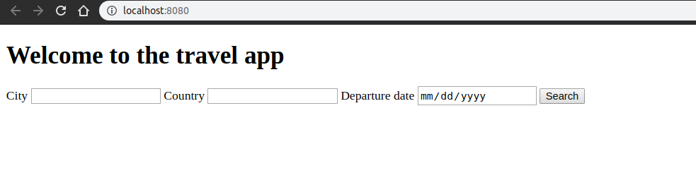

# Project approach

This project I will begin from the "backend" to have everythin ready so I can focus later on the Front-END-Design

## Project Requirements

### Basic

- Location to (city/country)
  - Advanced: Autocomplete location ?
- Departure date
- DarkSky API. Forecast:
  <= 7 days: Current Weather Forecast
  > 7 days: Predicted Forecast
- Save trip

-> Location -> GeonamesAPI (coordinates) -> DarkSky API (forecast)
-> Pixabay API (location/country image)

### Advanted

- Remove trip
- LocalStorage
- End Date of trip
- Multiple locations for a trip
- Hotel info
- Flight info
- Integrate the REST Countries API to pull in data for the country being visited.
- Multilpe days forecast
- Icons on forecast
- Print/PDF
- Packaging list
- Notes ?
- Additional trips:
  - Sort by countdown
  - Expired trips to bottom.

### After graduation

- i18n
- a11y

# Process

## APIs implementation and study

Branch `external-apis`

- Create the server with basic config and runed a basic project

```
node src/server/index.js
```

### [Geonames API](http://www.geonames.org/export/web-services.html)

- Add .env for the
- We want to get the latitude, longitude, country.

https://www.geonames.org/export/web-services.html#postalCodeSearch

Search by Location Name (use your username instead of demo):

http://api.geonames.org/postalCodeSearchJSON?placename=raleigh&username=demo

Parameters:

- placename string (postalcode or placename required)
- all fields : placename,postal code, country, admin name (Important:urlencoded utf8)

- Added `jest` package
- Added `node-fetch`

### [DarkSky API](https://darksky.net/dev)

DarkSky API (forecast)

As I don't want to run API queries all the time my tests are runned I added a enviroment setting to switch those queries (RUN_API_TESTS = "0")

We will use 2 different APIs:

- The [Forecast Request](https://darksky.net/dev/docs#forecast-request) returns the current weather forecast for the next week.

```
https://api.darksky.net/forecast/[key]/[latitude],[longitude]
```

- The Time Machine Request returns the observed or forecast weather conditions for a date in the past or future

### [Pixabay API](https://pixabay.com/api/docs/)

## Server endpoints

Branch `server-endpoints`

Now that we have our basic server queries for external APIs let's work on resolving the proper client calls to send the necessary fields to that client.

- Now we have this URL working:

```
http://localhost:3000/weather-forecast?city=%22Paris%22&time=01582383106

```

> We have some TODOs for us to work on but now we can build a basic html view to test this endpoint and show some basic info and test the results needed for our app

- I need to use the country for travel to so I added a countries.js file for searching for the country code for a given English county name

# Basic UI - webpack

Branch `basic-ui-webpack`

Let's test everything with a basic frontend with webpack

- Let's add the `package.json` from previous NPL project
- Create `webpack.dev.js` and `webpack.prod.js`
- Create `babel.config.js`
- Changed server route to serve static files

Let's test it with `yarn run build-dev`
We see it running and this:


Now that I added a basci UI I will try to make a design for mobile first, for icons these are all the icons that can be retreived from the DarskSky API:

clear-day, clear-night, rain, snow, sleet, wind, fog, cloudy, partly-cloudy-day, or partly-cloudy-night. (Developers should ensure that a sensible default is defined)

Let's go into the mobile design

# UI Mobile

Branch `ui-mobile`

I will try to add something like this:

- https://www.behance.net/gallery/28376165/CSS3-SVG-Material-Design-Weather-Card-Animation
- https://dribbble.com/shots/5382283-Weather-Card-UI

The form will appear above and on submit will scroll down to the results and show the save button as mobile design.
